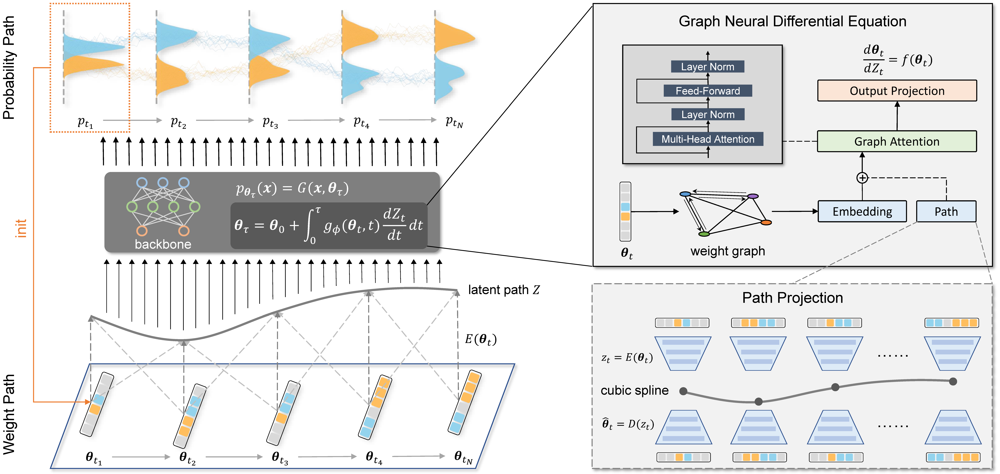

# 🌊 WeightFlow

Official implement of **AAAI'26** **(Oral)** "*WeightFlow: Learning Stochastic Dynamics via Evolving Weight of Neural Network*", a novel paradigm for modeling the continuous evolution of probability distributions by learning the dynamics directly in the weight space of a neural network.




## 🚀 How it Works

**WeightFlow** models complex stochastic dynamics by decoupling the problem into two main components:

1. **`Theta` (Backbone Model)**: An autoregressive model (e.g., GRU) that parameterizes the high-dimensional probability distribution $p(x∣\theta_t)$ at a single time snapshot t. Its parameters, $\theta_t$, are organized into a graph structure based on the neural network's architecture.
2. **`Phi` (Hypernetwork)**: A graph neural differential equation (`NeuralODE` or `NeuralCDE`) that learns the continuous dynamics of the backbone's weight graph. It evolves an initial weight state $\theta_{t_0}$ through time to predict future weight states $\theta_{t_1}$,$\theta_{t_2}$,..., thereby modeling the evolution of the underlying probability distribution.

This approach effectively learns the entire trajectory of distributions from a few discrete snapshots of the system.


## ⚙️ Setup & Demo

WeightFlow relies on standard deep learning libraries.

### Dependencies

- `torch`
- `torchdiffeq`
- `POT`
- `torchcde`
- `numpy`
- `pyyaml`
- `scikit-learn`
- `matplotlib`
- `tqdm`

### Demo

We provide `epidemic.ipynb` as runnable demo for understanding how *WeightFlow* works. Checkpoint and dataset are placed in `logs/`.

### Use your own dataset

The entire training process is handled by a single script, which automates a two-stage procedure: anchor pre-training and dynamics model training.

**1️⃣ Prepare Data** 

Place your trajectory data in the `data/` directory. The training script expects a `.npy` file containing system trajectories. For the `epidemic` system, the path would be:

```
data/epidemic/trajectories.npy
```

The data should be a NumPy array of shape `(num_trajectories, num_timesteps, num_species)`.

**2️⃣ Configure Your Run** 

Edit the YAML file (e.g., `config/epidemic.yaml`) to set hyperparameters for the `Theta` (backbone) and `Phi` (hypernetwork) models. You can choose the dynamics type:

- `dynamics_type: 'NeuralODE'`: A standard Neural ODE for the weight dynamics.
- `dynamics_type: 'NeuralCDE'`: A Controlled Differential Equation that learns dynamics along a projected latent path, often providing more stable long-term predictions.

**3️⃣ Execute Training** 

Run the main training script. The script will automatically perform both training stages.

```
python train.py --device cuda:0
```

- **Stage 1 (Anchor Pre-training):** The script first trains instances of the `Theta` backbone model on each observed data snapshot to obtain a set of "anchor" weights $\theta_{t_i}$.
- **Stage 2 (Dynamics Training):** The `Phi` hypernetwork is then trained to learn the differential equation that governs the evolution between these anchor weights.


## 📁 Repository Structure

```shell
.
├── README.md
├── train.py                  # Main training script
├── epidemic.ipynb            # Demo script
├── utils.py                  # Utility functions
├── config
│   └── epidemic.yaml         # Example configuration file
├── data
│   └── epidemic
│       └── trajectories.npy  # Example placeholder for training data
├── model
│   ├── backbone.py           # Defines the Theta (Backbone) autoregressive model
│   ├── hypernet.py           # Defines the Phi (Hypernetwork) and the main training loop
│   ├── NeuralODE.py          # Implements the Neural ODE dynamics function
│   └── NeuralCDE.py          # Implements the Neural CDE dynamics function
└── log/                        # Output directory for models, plots, and cached weights
    └── ...
```


## 📌 Notes

- This repository provides the reference implementation for the **WeightFlow** framework.
- The provided code is configured for the `epidemic` dataset as an example. You can adapt it to other systems by creating a corresponding data folder and configuration file.
- The choice between `NeuralODE` and `NeuralCDE` via the config file allows you to explore both implementations discussed in the paper. The CDE version generally achieves better performance by capturing the global manifold of the dynamic path.


## ✨ Citation

If you find this repo helpful, please cite our paper.

```
@article{li2025weightflow,
  title={WeightFlow: Learning Stochastic Dynamics via Evolving Weight of Neural Network},
  author={Li, Ruikun and Liu, Jiazhen and Wang, Huandong and Liao, Qingmin and Li, Yong},
  journal={arXiv preprint arXiv:2508.00451},
  year={2025}
}
```

